# Pricing Crawla & Job Search

Two new feature modules for CRWLA. Both are Starter+ subscription features, both share the same plan-gating + recent-searches + delete UX, and both follow the same backend pipeline shape.

```
 ┌──────────────────────────┐        ┌──────────────────────────┐
 │   💰  Pricing Crawla     │        │   💼  Job Search         │
 │                          │        │                          │
 │   Search → Results       │        │   Search → Results       │
 │      ↓                   │        │                          │
 │   Product detail         │        │   Admin: 🏢 Tracked      │
 │                          │        │   companies (CRUD)       │
 └──────────────────────────┘        └──────────────────────────┘
            │                                       │
            └───────────────┬───────────────────────┘
                            ▼
            ┌──────────────────────────────────┐
            │  🔒  FeatureAccessService        │
            │       (single DB-backed gate)    │
            └──────────────────────────────────┘
```

---

## 1. Pricing Crawla 💰

> Search any product, get live prices from real retailers, compare with reviews + a YouTube unboxing.

### 1a. User journey

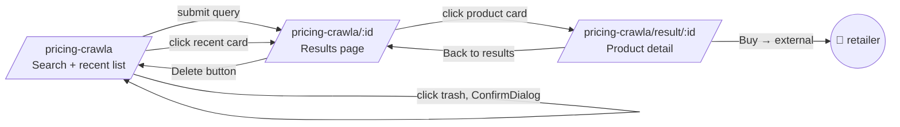

Each box is a real Next.js route segment with its own `page.tsx` + `*-client.tsx` + `opengraph-image.tsx`.

### 1b. Backend pipeline

When the user submits a search:

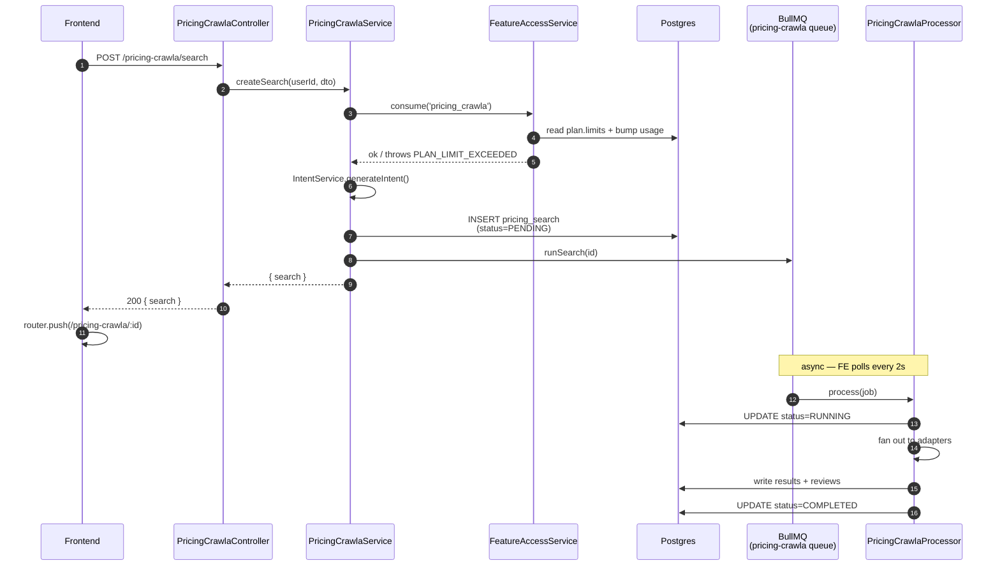

### 1c. The crawl pipeline (inside the processor)

This is the multi-stage filter that turns a query into clean rows. **Every gate that fails drops the listing** — no fake data leaks through.

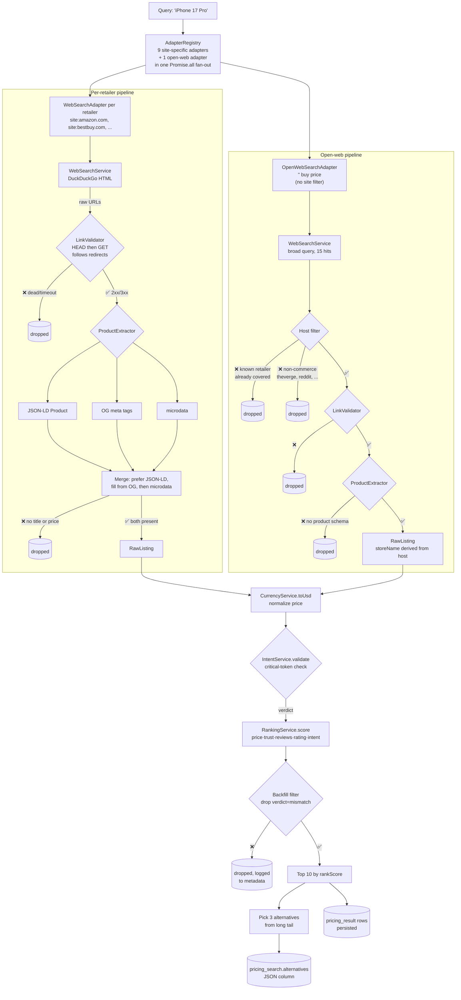

**Two channels, same refinement.** Site-specific adapters use `site:` filters so they're targeted; the **open-web adapter** runs a broad search and refines via:

1. **Known-retailer skip** — drops URLs whose host is already covered by a site-specific adapter (shared `KNOWN_RETAILER_DOMAINS` set; no double-counting).
2. **Non-commerce blocklist** — drops obvious news/review/social hosts (wikipedia, theverge, reddit, twitter, …) before spending a network round-trip.
3. **Live URL check** — same `LinkValidatorService` everyone uses.
4. **Product-schema check** — the `ProductExtractorService` only returns when JSON-LD `Product`, `og:price:amount`, or microdata `itemprop="price"` is present. Editorial pages don't have these — only real listings do.
5. **Per-listing storeName** is derived from the URL host (`newegg.com` → "Newegg"), so the FE shows the actual retailer name rather than "Open Web".
6. **Lower trust** (baseline 0.45, hint 0.4) so open-web listings only outrank curated retailers when the price is genuinely lower.

### 1d. Intent validation (catches version drift)

The validator is the **primary backstop** for "user searched iPhone 17, got iPhone 15" bugs:

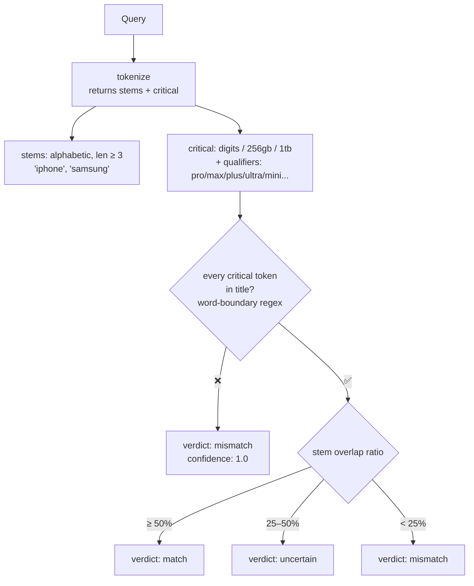

Numeric tokens match with digit boundaries so `17` matches `iPhone 17 Pro` but **not** `iPhone 17X` or `2017`.

### 1e. Data model

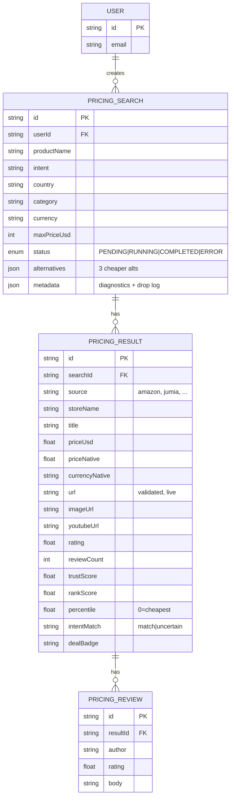

### 1f. HTTP endpoints

| Method | Path | What |
|---|---|---|
| `POST` | `/pricing-crawla/search` | Create + enqueue a search (gate + consume) |
| `GET` | `/pricing-crawla/searches` | Recent searches for current user |
| `GET` | `/pricing-crawla/:searchId/results` | Results for a search (polled while RUNNING) |
| `GET` | `/pricing-crawla/result/:id/details` | Product detail + reviews |
| `GET` | `/pricing-crawla/meta` | Trending products, countries, categories, stats |
| `GET` | `/pricing-crawla/rates` | Live FX table |
| `POST` | `/pricing-crawla/convert-currency` | USD → target conversion |
| `DELETE` | `/pricing-crawla/:id` | Hard-delete (cascade) |

---

## 2. Job Search 💼

> Skip job boards. Crawl tracked company career pages directly. AI-scored relevance, salary extraction.

### 2a. User journey

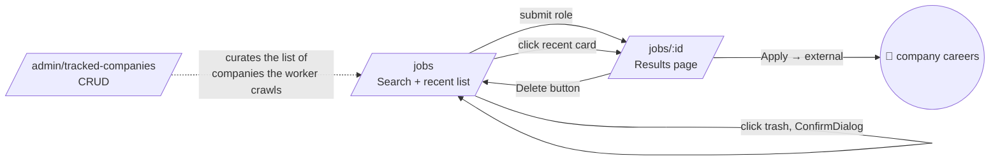

### 2b. Backend pipeline

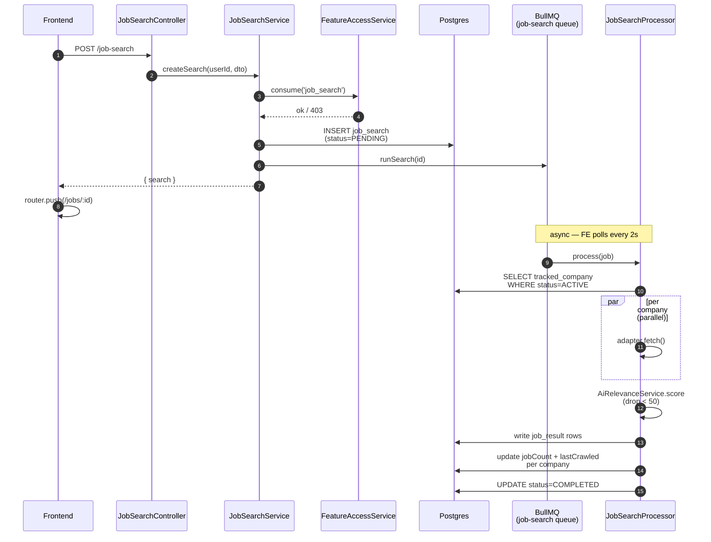

### 2c. Relevance scoring

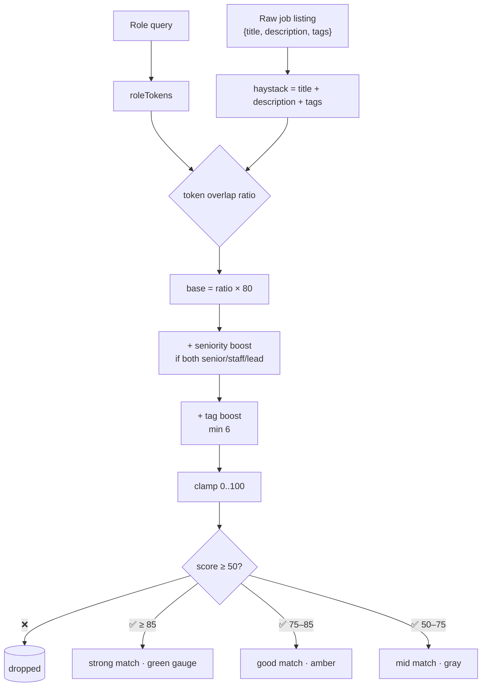

### 2d. Tracked Companies admin

Admin-only CRUD page that drives **which** companies the worker crawls. A row at `status=PAUSED` is silently excluded from the next sweep without losing its history.

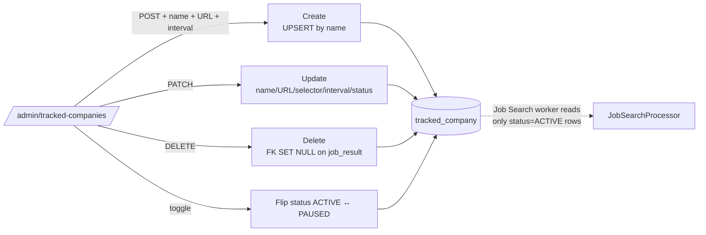

### 2e. Data model

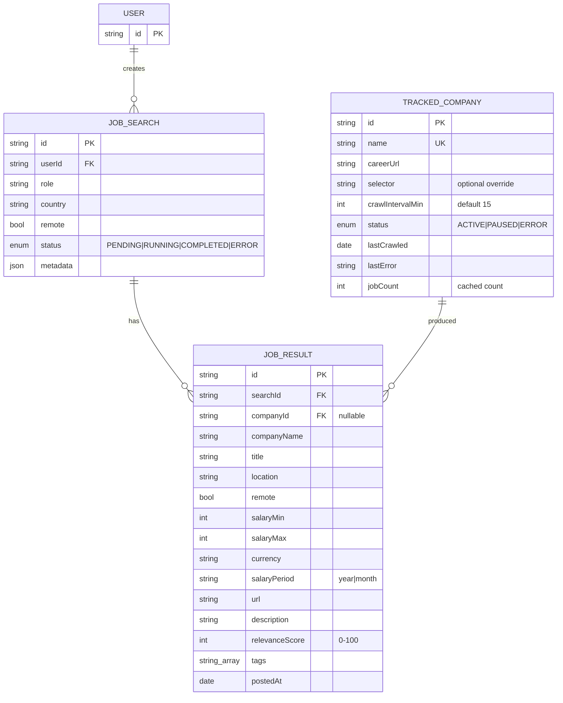

### 2f. HTTP endpoints

| Method | Path | What |
|---|---|---|
| `POST` | `/job-search` | Create + enqueue a search (gate + consume) |
| `GET` | `/job-search` | Recent searches for current user |
| `GET` | `/job-search/:id/results` | Results for a search |
| `GET` | `/job-search/meta` | Hot titles, countries, stats |
| `DELETE` | `/job-search/:id` | Hard-delete (cascade) |
| `GET` | `/admin/tracked-companies` | List (admin) |
| `POST` | `/admin/tracked-companies` | Create (admin) |
| `PATCH` | `/admin/tracked-companies/:id` | Update (admin) |
| `DELETE` | `/admin/tracked-companies/:id` | Delete (admin) |

---

## 3. Shared infrastructure 🔒

### 3a. FeatureAccessService — the single gate

Both features use the **same** gating service. Adding a new gated feature is one entry in the registry — no new `assertX` method, no new controller endpoint, no FE wiring change.

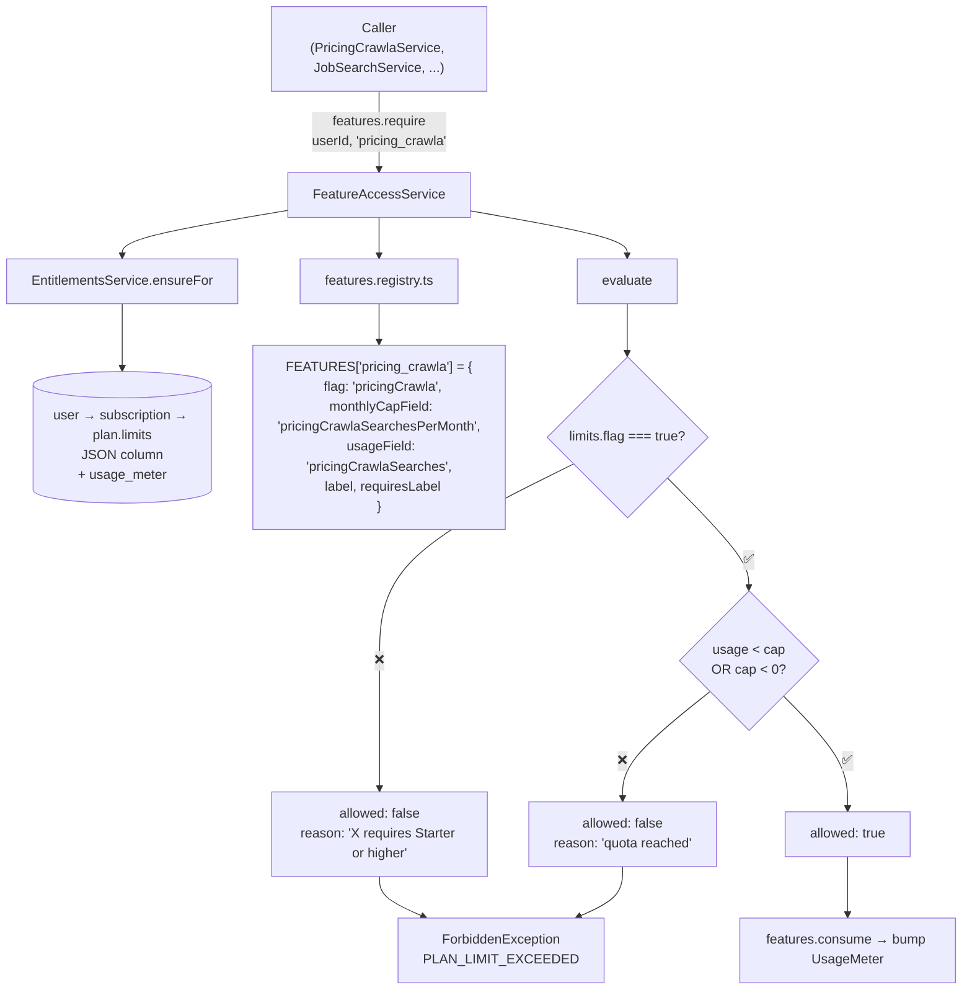

The FE reads `GET /features/access` once at mount and uses the response to drive sidebar visibility, upgrade cards, and quota labels. **Whatever the admin sets in `/admin/billing → Edit plan` flows here automatically.**

### 3b. Plan gating UX

```mermaid
flowchart LR
    User[User opens /pricing-crawla]
    User --> FE[useFeature 'pricing_crawla']
    FE --> Q{allowed?}
    Q -->|✅| Page[Render Search + recent]
    Q -->|❌ FREE plan| Up[Upgrade card<br/>label from registry<br/>requiresLabel: 'Starter or higher']
    Up --> Bill[/billing]
```

### 3c. Recent searches + delete

Both pages render `<RecentSearches />` at the bottom. Each card:

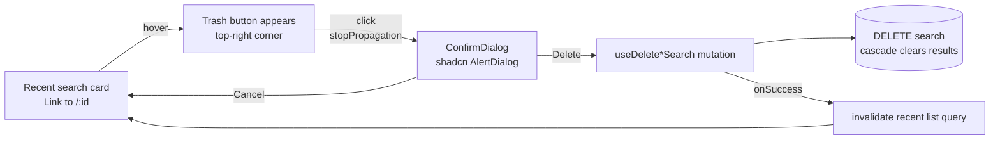

Same pattern on the standalone results page header (`/pricing-crawla/:id`, `/jobs/:id`) — Delete button, ConfirmDialog, on success → `router.push` back to the index.

---

## 4. Frontend routes

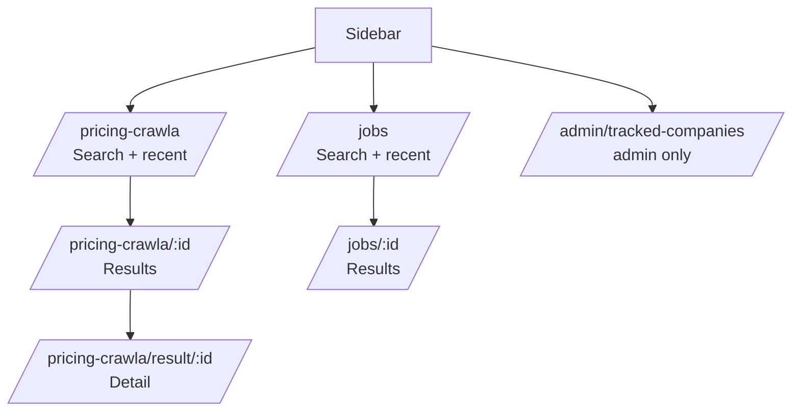

Every route has a sibling `opengraph-image.tsx` (per the I-9 stop-hook policy).

---

## 5. Operations 🛠

### How to add a new gated feature

1. Add a flag (and optional cap) to `PlanLimits` in `apps/api/src/modules/billing/plans.catalog.ts`.
2. Add a registry entry to `FEATURES` in `apps/api/src/modules/billing/features.registry.ts`.
3. In the feature's service, call `features.require(userId, '<new_key>')` or `features.consume(...)`.
4. On the FE, gate the UI with `useFeature('<new_key>')`.

That's it. The admin pricing card and upgrade modal both pick up the new bullet from `deriveFeatures()` automatically.

### How to add a new pricing retailer

Add a single entry to `RETAILERS` in `apps/api/src/modules/pricing-crawla/adapters/adapter.registry.ts`:

```ts
{ id: 'newegg', storeName: 'Newegg', domain: 'newegg.com',
  baselineTrust: 0.85, category: 'marketplace' }
```

`WebSearchAdapter` handles the rest (search → validate → extract). The
domain auto-joins `KNOWN_RETAILER_DOMAINS`, so the open-web adapter stops
discovering URLs from this retailer to avoid duplicates.

**When to promote an open-web discovery to a site-specific adapter**:
when a retailer shows up repeatedly in `pricing_result.metadata.host`
and you want a higher baseline trust score, dedicated SERP slots, or a
guaranteed search-position even when the open-web hit rate is noisy.

### How to add a new tracked company

Admin opens `/admin/tracked-companies → Add company`. The next worker sweep (default every 15 min) picks it up.

### Where rejected listings get logged

`pricing_search.metadata` includes:
- `adapterCount` — how many adapters fanned out
- `totalCollected` — raw listings from all adapters (pre-filter)
- `uniqueAfterDedup` — after `source::title` collapse
- `cleanForRanking` — after the mismatch backfill filter
- `keptAfterRanking` — what made it to disk (top 10 by rankScore)
- `droppedForMismatch` — failed the intent backstop
- `sampleDropReasons` — first 5 mismatch reasons (store, title, why)
- `errors` — per-adapter failures
- `durationMs`

The funnel from `totalCollected → keptAfterRanking` is the most useful
debugging signal: a large gap means the search is finding plenty of
candidates but ranking/filtering is rejecting most of them — usually
because intent validation is catching version drift.

Useful for figuring out why a search returned fewer results than expected.

### Source of truth quick reference

| Question | Where to look |
|---|---|
| What features exist? | `apps/api/src/modules/billing/features.registry.ts` |
| What's a user's plan allow? | `plan.limits` JSON in DB (admin-editable via `/admin/billing`) |
| Which retailers do we crawl? | `RETAILERS` in `adapter.registry.ts` |
| Which companies do we crawl? | `tracked_company` table (admin UI) |
| Why was a listing dropped? | `pricing_search.metadata.sampleDropReasons` |
| Why was a job dropped? | Relevance below 50 (configured in `AiRelevanceService.DROP_BELOW`) |
