# web-page-extractor-llm — end-to-end

A specialized open-source LLM service for extracting structured JSON
from arbitrary web pages. Runs on Railway. Single Docker image bundles
Ollama (inference) + FastAPI (the workflow), backed by Postgres +
pgvector (cache + few-shot corpus).

```
   📥  Web page (URL or HTML)        📤  Validated JSON matching schema
       │                                 ▲
       ▼                                 │
   ┌────────────────────────────────────────────┐
   │   fetch → retrieve K-shot → LLM extract    │
   │   → validate + retry → persist + learn     │
   └────────────────────────────────────────────┘
                       │
                       ▼
                ┌────────────┐    ┌──────────────┐
                │  🧠 Ollama │    │  🗄️ pgvector │
                │  (Qwen 7B) │    │  cache + KB  │
                └────────────┘    └──────────────┘
```

---

## 1. The fixed contract 📜

Every call uses this 80-token system prompt. **The fine-tuned model is
trained against this exact string** — changing it breaks the contract.
It lives once in `src/prompts.py` and is baked into the Ollama
Modelfile too, so any caller — including `/v1/chat/completions` ones
who forget to set a system message — gets the same guarantee.

```
You read web pages and extract structured data.

Given HTML (or extracted text) and a goal that includes a JSON schema,
return ONLY a JSON object matching the schema. Use only facts present
on the page; null any field you cannot verify; never invent values.
If prior example outputs from the same site are attached, mirror
their shape. No prose, no markdown fences — JSON only.
```

Three guarantees we rely on:

1. **Schema-only output** — never prose, never markdown fences
2. **No invention** — unverifiable fields return `null`
3. **Mirror prior examples** — the few-shot priming has teeth

---

## 2. End-to-end architecture

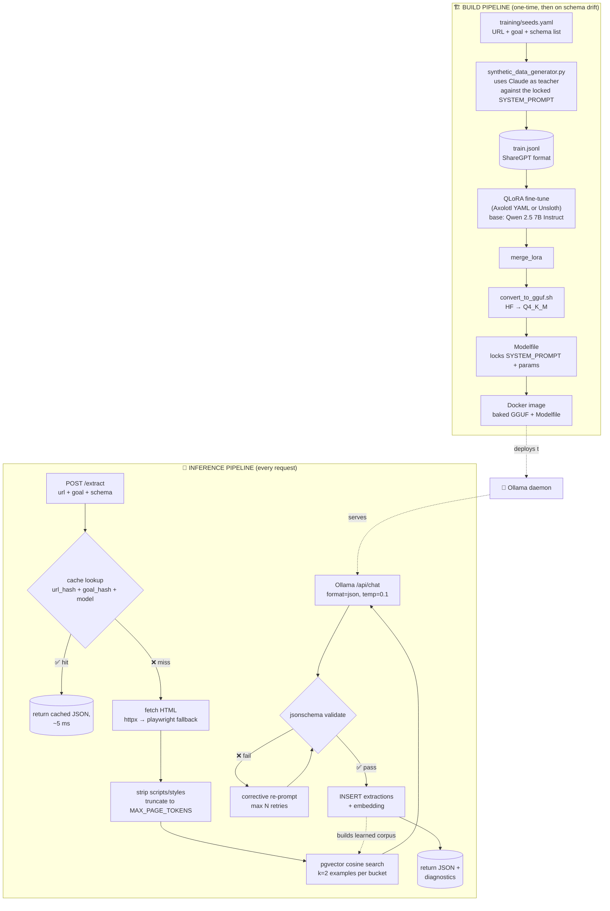

---

## 3. The build pipeline (training)

How we turn the locked prompt + a list of URLs into a fine-tuned
GGUF that ships in the container.

### 3a. Synthetic data generation

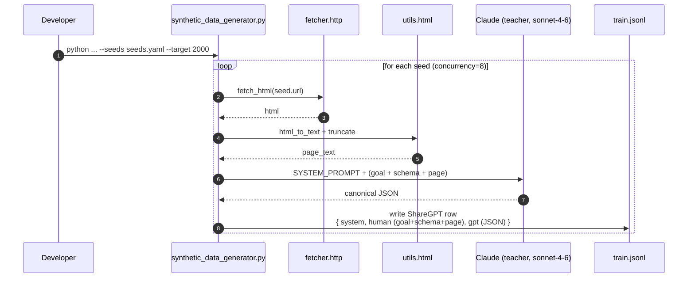

Why Claude as teacher? It's strong enough to produce reference JSON
even on weird retailer pages, and using the **same system prompt +
user-message layout** that the student model will see at serve time
means train ≡ serve byte-for-byte. No prompt drift, no train-test gap.

Each ShareGPT row looks like:

```json
{
  "conversations": [
    {"from": "system", "value": "<SYSTEM_PROMPT verbatim>"},
    {"from": "human",  "value": "GOAL: ...\n\nSCHEMA: {...}\n\nPAGE: ..."},
    {"from": "gpt",    "value": "{\"title\": ..., \"price\": ...}"}
  ]
}
```

### 3b. QLoRA fine-tune

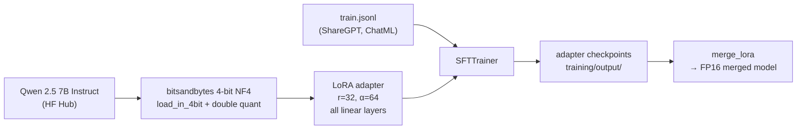

Key configs (`training/axolotl_qlora.yaml`):

- `sequence_len: 8192` — fits big product pages + the JSON output
- `sample_packing: true` — boost effective batch size on the GPU
- `train_on_inputs: false` — loss only on the assistant turn, so the
  HTML doesn't dominate the gradient
- `lora_target_linear: true` — generalises better than Q/V-only LoRA
- 3 epochs × 2K examples on a single A100 ≈ 1.5 h

Swap to Unsloth (`training/unsloth_train.py`) if you want a faster
single-file run with the same hyperparameters.

### 3c. Quantization + Ollama packaging

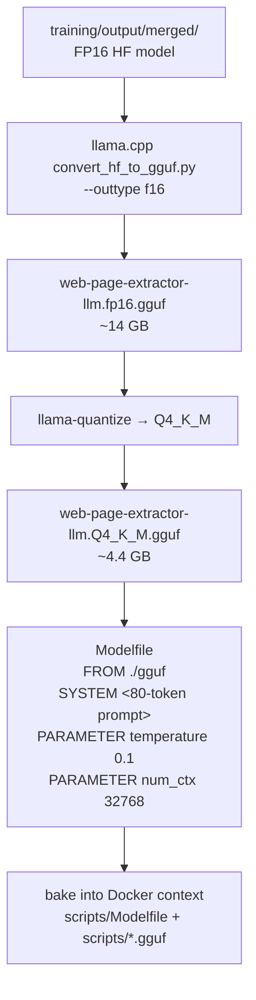

Quantization choice:

| Quant | Size (7B) | RAM (16K ctx) | Quality |
|---|---|---|---|
| Q4_K_M | 4.4 GB | ~6 GB | **default — best balance** |
| Q5_K_M | 5.1 GB | ~7 GB | slight quality bump |
| Q6_K | 5.9 GB | ~8 GB | near-FP16 |

The Modelfile pins the system prompt at the model layer so the
contract holds even when callers bypass our FastAPI service.

---

## 4. The inference pipeline (request)

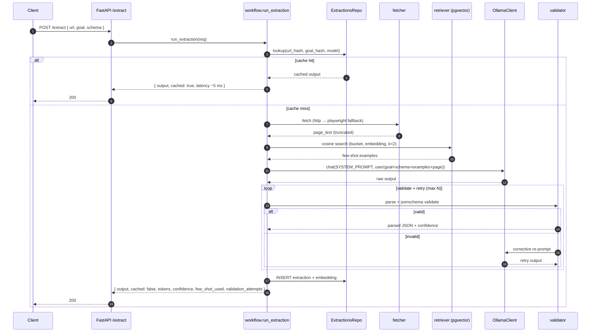

### 4a. The five workflow nodes (LangGraph)

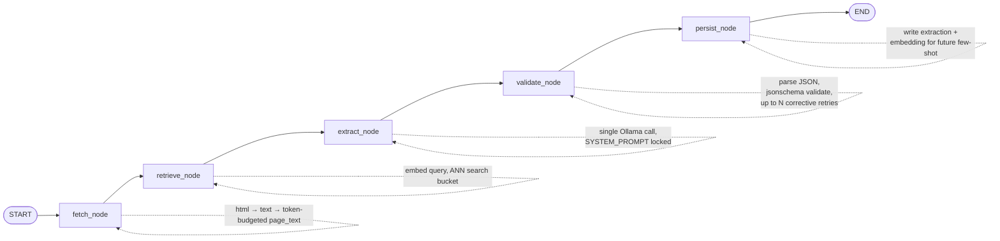

Each node is a plain async function — testable standalone, swappable
without touching the others. LangGraph is the orchestrator; the same
five functions chain cleanly without it if needed.

### 4b. Fetcher escalation

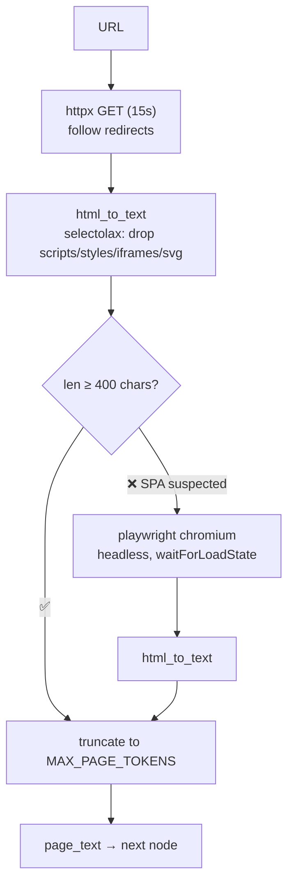

Cheap path first. ~95% of retailer product pages ship JSON-LD + OG
server-side, so they never need Chromium. Set `ALWAYS_RENDER_JS=true`
to force the heavy path on every request.

### 4c. Few-shot retrieval

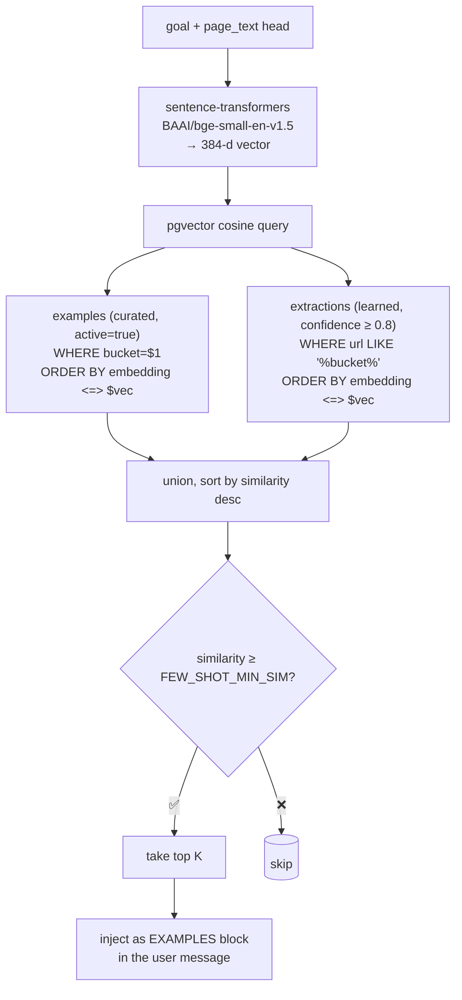

Two-tier source:

| Tier | Source | Quality | Volume |
|---|---|---|---|
| **Curated** | `examples` table, reviewer-blessed | Highest | Small |
| **Learned** | `extractions` with `confidence ≥ 0.8` | Good | Grows over time |

The corpus self-improves: every successful extraction becomes a future
few-shot candidate for the same retailer.

### 4d. Validator + corrective retry

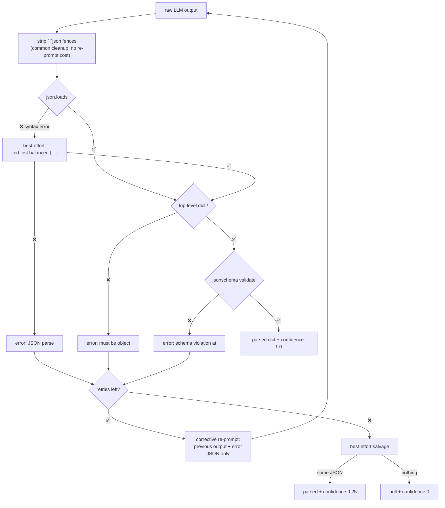

Confidence shrinks with each retry: `1.0 → 0.8 → 0.6 → 0.25 (salvaged) → 0 (gave up)`.
Callers see this number and can decide what to do — typically `< 0.5`
rows aren't promoted into the example corpus.

### 4e. Persistence + the learning loop

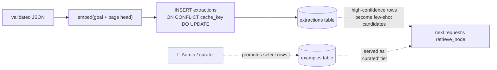

The cache key `(url_hash, goal_hash, model)` makes re-extractions
free, while the `embedding` column makes every past extraction
discoverable as a future few-shot example. The system gets smarter at
each retailer over time without changing the model weights.

---

## 5. Data model

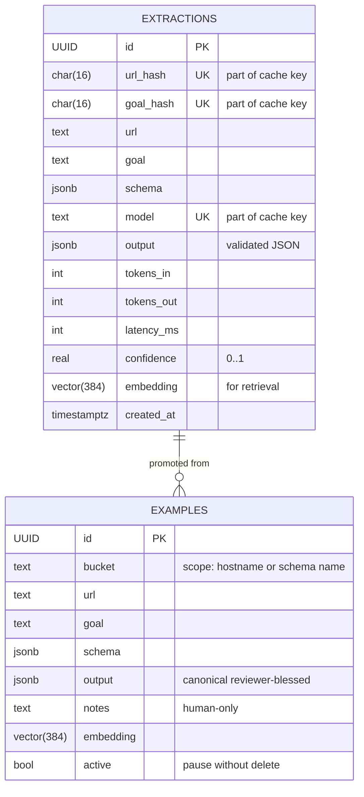

Indexes:

- `UNIQUE (url_hash, goal_hash, model)` on extractions — the cache key.
- `ivfflat (embedding vector_cosine_ops)` on both tables — ANN
  retrieval. Tune `lists` to `sqrt(rowcount)` once you're past a
  few thousand rows.
- Partial index on `examples (bucket) WHERE active` — fast per-bucket
  scope without filtering inactive rows.

---

## 6. Deployment topology

Two containers, never one. Bundling Ollama into the FastAPI image made
builds fragile (the ~1.5 GB upstream tarball is a single long-lived
curl that dies on any network blip). Splitting them lets `docker pull`
chunk + resume the Ollama image layers, and lets each container have
one responsibility.

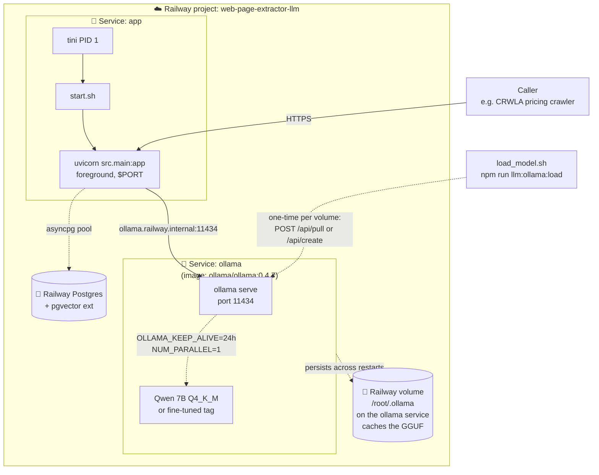

Key choices:

- **Separate Ollama service**: `docker pull ollama/ollama` uses chunked
  + resumable layer protocol; surviving flaky networks is built in.
  The Ollama image is also pre-warmed by upstream — no `apt-get` /
  `curl` install dance at build time.
- **`app` service is small (~600 MB)**: just Python + FastAPI + sentence-
  transformers + Playwright chromium. Boots in seconds. Cheap to scale
  horizontally — they're stateless apart from the DB pool.
- **Volume at `/root/.ollama` on the OLLAMA service**: the 4–8 GB GGUF
  survives container restarts. First boot: ~2–4 min download. After:
  ~5 s.
- **Model loading is out-of-band**: `scripts/load_model.sh` POSTs to
  `/api/pull` (public tag) or `/api/create` (local Modelfile) once per
  fresh Ollama volume. `start.sh` no longer manages it.
- **Postgres as a separate Railway plugin**: connected via
  `DATABASE_URL` env, pgvector preinstalled.
- **`/health` for liveness, `/ready` for readiness** — Railway
  health-checks `/health` with a 180 s start period. `/ready` pings
  Ollama + Postgres to confirm both dependencies are reachable.

### Local-dev parity

`apps/web-page-extractor-llm/docker-compose.yml` mirrors the production
shape: an `ollama` service + an `app` service on a shared bridge
network, with the same `ollama:11434` hostname so `OLLAMA_HOST` doesn't
have to change between dev and prod.

### Resource sizing

| Model | RAM (16K ctx) | Plan |
|---|---|---|
| Qwen 2.5 7B Q4_K_M | ~6 GB | **16 GB / 4 vCPU** ← default |
| Qwen 2.5 7B Q5_K_M | ~7 GB | 16 GB / 4 vCPU |
| Qwen 2.5 14B Q4_K_M | ~10 GB | 32 GB / 8 vCPU |
| Qwen 2.5 3B Q4_K_M | ~3 GB | 8 GB / 2 vCPU (downgrade option) |

---

## 7. The full lifecycle on one page

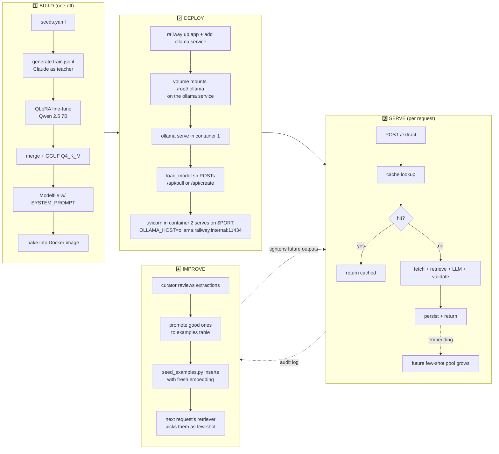

---

## 8. Operations

### Anti-hallucination defences (layered)

| Layer | What | When it fires |
|---|---|---|
| SYSTEM prompt | "never invent values" | Every call |
| Modelfile SYSTEM | Same string baked in Ollama | Every call (even raw chat API) |
| `format: "json"` in Ollama options | Forces parseable JSON at the sampler | Every call |
| `temperature: 0.1` + `top_p: 0.9` | Low-variance decoding | Every call |
| Fine-tune contract | Model memorised the schema-only shape | Every call (with fine-tuned tag) |
| Few-shot priming | Examples show "this is what null looks like" | When examples cosine ≥ 0.55 |
| jsonschema validator | Reject anything off-spec | After every call |
| Corrective retry | Re-prompt with the validator error | Up to N retries |
| Best-effort salvage | Extract first balanced `{…}` from prose | When all retries fail |

### Debugging a bad output

1. Look at `validation_attempts` in the response. Empty = model produced
   valid JSON first try. Non-empty = each retry's error.
2. Look at `few_shot_used`. Empty means the retriever found nothing
   above threshold for this bucket — the curated corpus is sparse.
3. Look at `confidence`. Below `0.5` → either a salvaged output or
   no examples available. Not safe to cache long-term.
4. Pull the row from `extractions` by `url + goal` and inspect the
   `output` JSON manually. Promote to `examples` if it's actually
   correct; the model just needed an example.

### Scaling

- **Concurrency**: `--workers 1` per replica (shared embedder + DB
  pool). For higher RPS, scale replicas in `railway.json`.
- **Cache hit rate**: typically 60–80% in steady state when the same
  retailer + schema combo gets queried repeatedly. Each hit ≈ 5 ms
  (single indexed lookup + JSON decode).
- **Model swap**: change `MODEL_NAME` env → restart. Cache rows
  invalidate per-model so no cross-contamination.

### Tightening for production

- Set `API_TOKEN` env to require Bearer auth on both routes.
- Bump ivfflat `lists` to `√(rowcount)` once the corpus passes 10K rows.
- Promote the top 5–10% of `extractions` per bucket to `examples`
  monthly so the curated tier stays meaningful.
- Run `VACUUM ANALYZE extractions` weekly if you turn caching off
  (frequent updates without inserts → bloat).

---

## 9. Source-of-truth reference

| What | Where |
|---|---|
| The locked system prompt | `apps/web-page-extractor-llm/src/prompts.py` |
| Cache key derivation | `src/utils/hashing.py` (`url_hash`, `goal_hash`) |
| Workflow nodes | `src/agent/nodes.py` |
| Cache lookup query | `src/db/repositories.py::ExtractionsRepo.lookup` |
| Few-shot retrieval SQL | `src/agent/retriever.py` |
| Validation + retry policy | `src/agent/validator.py` |
| Training config | `training/axolotl_qlora.yaml` |
| Data generator | `training/synthetic_data_generator.py` |
| GGUF conversion | `training/convert_to_gguf.sh` |
| Entrypoint script | `scripts/start.sh` |
| Docker / Railway | `Dockerfile`, `railway.json` |
| Schema | `db/migrations/001_init.sql` |
